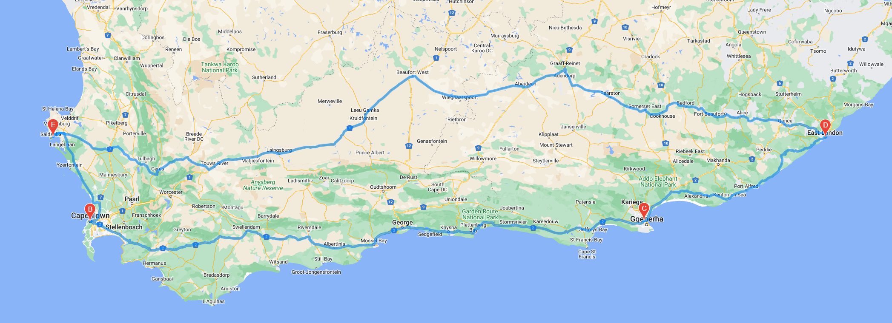

# World_Weather_Analysis
## Project Overview
The purpose of this project is to create a travel tool where customers can input their weather preferences to identify potential travel destinations and nearby hotels by retrieving the data using APIs. Additionally, the customer can then choose four cities to visit to create a travel itinerary using the Google Maps Directions API.

## Project Results
### Weather Data Retrieval
I first randomly created 2,000 lat/long locations using a random generator and then found the nearest cities with the citipy module. The weather data was obtained using the OpenWeatherMap API, specifically I requested and got the lat/long, max temperature, humidity %, cloudiness %, wind speed, and weather description values.

### Travel Destinations Map Created
To create the travel destination and map, I created a user input to select their desired min/max temperature range and filtered the dataframe based on their selection. I then found the nearest hotels using the Google Maps nearby search API. Using a marker layer map, I added pop-markers with weather information for each remaining city travel destination.

### Travel Itinerary Map Created
Lastly, I chose four nearby cities to create a travel route using the Google Maps directions layer map API and added pop-up markers with the weather information for each city.

